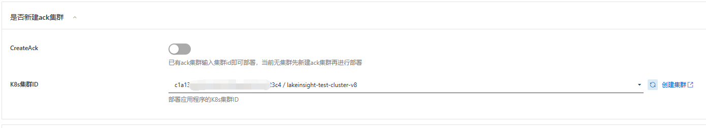
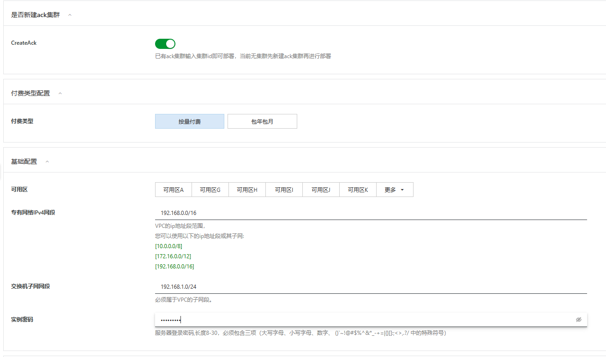
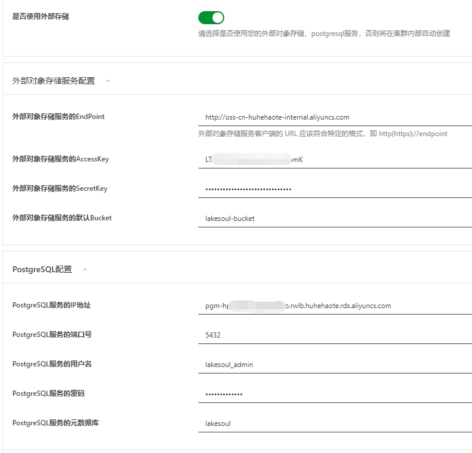
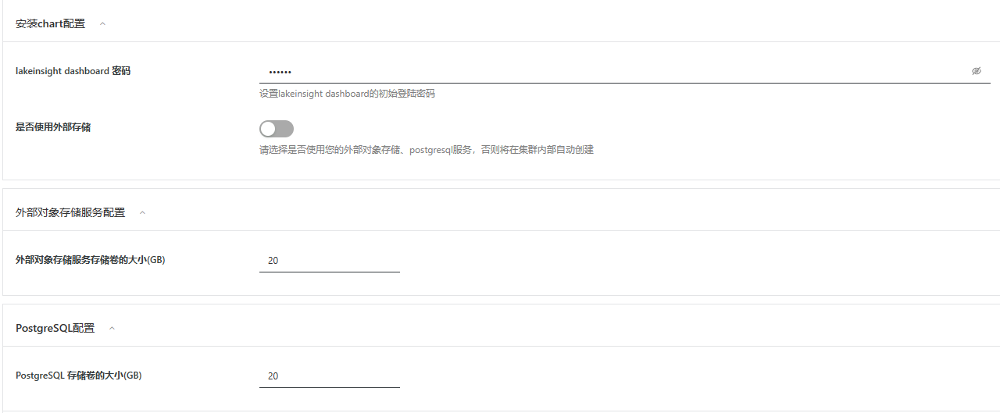
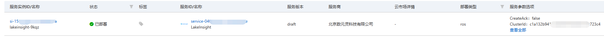
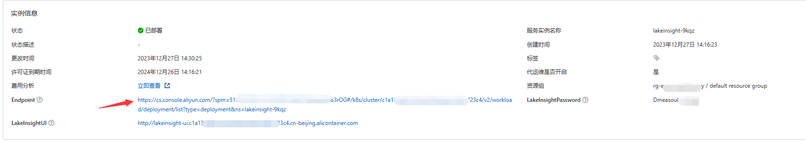
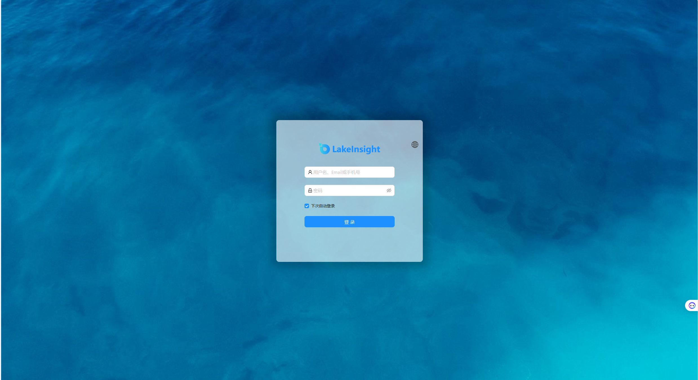
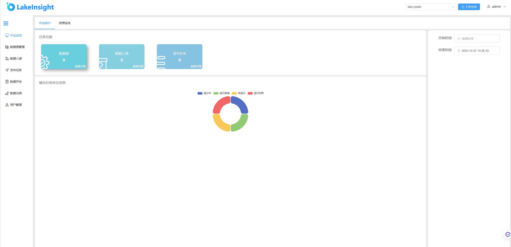

# LakeInsight服务实例部署文档

## 概述

LakeInsight 是开放式多模态湖仓，支持流、批、MPP、AI 等多种计算模式，一站式构建 Data + AI 一体化的现代数据栈。LakeInsight 支持全量和实时增量计算，一份数据同时无缝对接 BI 报表和 AI 训练。LakeInsight 采用云原生容器化和存算分离的架构，在云上能够获得极致的弹性和性价比。

## 计费说明

LakeInsight目前支持两种模式进行部署

- 已有阿里云ack集群，这种情况下可以直接将服务部署到该集群中，用户仅需支付软件费用。
- 新建阿里云ack集群，然后部署服务，这种情况下用户需支付ack资源本身的费用和软件费用。
  
LakeInsight在计算巢上的费用主要涉及

- 所选vCPU与内存规格
- 磁盘容量
- 公网带宽
- ack集群费用
- 软件费用

计费方式包括

- 按量付费（小时）: 主要为云资源费用
- 包年包月：        LakeInsight 包年包月License费用及云资源费用
  
预估费用在创建实例时可实时看到。

LakeInsight的软件服务有以下四个版本可供选择

- 试用版
- 基础版
- 高级版
- 大企业版

## 部署架构

LakeInsight服务为容器服务，部署在ACK容器服务集群上。

## RAM账号所需权限

LakeInsight服务需要对ECS、VPC等资源进行访问和创建操作，若您使用RAM用户创建服务实例，需要在创建服务实例前，对使用的RAM用户的账号添加相应资源的权限。添加RAM权限的详细操作，请参见[为RAM用户授权](https://help.aliyun.com/document_detail/121945.html)。所需权限如下表所示。

| 权限策略名称 | 备注 |
| --- | --- |
| AliyunECSFullAccess | 管理云服务器服务（ECS）的权限 |
| AliyunVPCFullAccess | 管理专有网络（VPC）的权限 |
| AliyunROSFullAccess | 管理资源编排服务（ROS）的权限 |
| AliyunComputeNestUserFullAccess | 管理计算巢服务（ComputeNest）的用户侧权限 |
| AliyunCloudMonitorFullAccess | 管理云监控（CloudMonitor）的权限 |
| AliyunCSFullAccess | 管理容器服务(CS)的权限 |
| 	AliyunTagAdministratorAccess | 管理标签服务（TAG）和所有阿里云产品标签的权限 |

## 部署流程

### 部署步骤

1. 单击部署链接，进入服务实例部署界面。您可以在阿里云计算巢自行搜索LakeInsight，进行订阅。
2. 根据界面提示，填写参数完成部署。

### 部署参数说明

您在创建服务实例的过程中，需要配置服务实例信息。下文介绍LakeInsight服务实例在已有ack集群和新建ack集群以及是否使用外部存储的情况下所需输入参数的详细信息。

- 已有ack集群

| 参数组 | 参数项 | 示例 | 说明 |
| --- | --- | --- | --- |
| 服务实例名称 |  | test | 实例的名称 |
| 地域 |  | 华东1（杭州） | 选中服务实例的地域，建议就近选中，以获取更好的网络延时。 |
| 是否新建ack集群 | 是否新建ack集群	 | 否 | 选择否代表已有ack集群，不用新建 |
| 是否新建ack集群 | K8s集群ID | ccde6dxxxxxxxxxxxx1230d | 根据地域选择地域中用户已有的集群id |

- 新建ack集群

| 参数组 | 参数项 | 示例 | 说明 |
| --- | --- | --- | --- |
| 服务实例名称 |  | test | 实例的名称 |
| 地域 |  | 华东1（杭州） | 选中服务实例的地域，建议就近选中，以获取更好的网络延时。 |
| 是否新建ack集群 |  | 是 | 选择是代表新建ack集群 |
| 付费类型配置 | 付费类型 | 按量付费 或 包年包月 |  |
| 基础配置 | 可用区 | 可用区I | 地域下的不同可用区域 |
| 基础配置 | 专有网络IPv4网段 | 192.168.0.0/16 | VPC的ip地址段范围 |
| 基础配置 | 交换机子网网段 | 192.168.1.0/24 | 必须属于VPC的子网段 |
| 基础配置 | 实例密码 | ******** | 设置实例密码。长度8~30个字符，必须包含三项（大写字母、小写字母、数字、()~!@#$%^&*-+={}[]:;'<>,.?/ 中的特殊符号） |
| Kubernetes配置 | Worker节点规格 | ecs.g6.large | 选择对应cpu核数和内存大小的ecs实例，用作k8s节点 |
| Kubernetes配置 | Worker 系统盘磁盘类型 | ESSD云盘 | 选择k8s集群Worker节点使用的系统盘磁盘类型 |
| Kubernetes配置 | Worker节点系统盘大小(GB) | 120 | 设置Worker节点系统盘大小，单位为GB |
| Kubernetes配置 | Service CIDR | 172.16.0.0/16 | ack Service网络段, 可选范围：10.0.0.0/16-24，172.16-31.0.0/16-24，192.168.0.0/16-24,不能与 VPC 及 VPC 内已有 Kubernetes 集群使用的网段重复。 |
| Kubernetes配置 | Pod 网络 CIDR | 10.0.0.0/8 | ack Pod网络段，网络插件为Flannel时必填，请填写有效的私有网段，即以下网段及其子网：10.0.0.0/8，172.16-31.0.0/12-16，192.168.0.0/16，不能与 VPC 及 VPC 内已有 Kubernetes 集群使用的网段重复。 |

- 使用外部存储

| 参数组 | 参数项 | 示例 | 说明 |
| --- | --- | --- | --- |
| 安装chart配置 | LakeInsight dashboard 密码 | 123456 | 自定义首次打开LakeInsight界面的登录密码 |
| 安装chart配置 | 是否使用外部存储 | 是 | 选择是代表使用已有的外部对象存储服务和PostgreSQL服务 |
| 外部对象存储服务配置 | 外部对象存储服务的EndPoint |  |  |
| 外部对象存储服务配置 | 外部对象存储服务的AccessKey |  |  |
| 外部对象存储服务配置 | 外部对象存储服务的SecretKey |  |  |
| 外部对象存储服务配置 | 外部对象存储服务的默认Bucket |  |  |
| PostgreSQL配置 | PostgreSQL服务的IP地址 | 是 | 选择是代表使用已有的外部存储 |
| PostgreSQL配置 | PostgreSQL服务的端口号 |  |  |
| PostgreSQL配置 | PostgreSQL服务的用户名 |  |  |
| PostgreSQL配置 | PostgreSQL服务的密码 |  |  |
| PostgreSQL配置 | PostgreSQL服务的元数据库 |  |  |

外部存储填写示例如下：

- 不使用外部存储

| 参数组 | 参数项 | 示例 | 说明 |
| --- | --- | --- | --- |
| 安装chart配置 | LakeInsight dashboard 密码 | 123456 | 自定义首次打开LakeInsight界面的登录密码 |
| 安装chart配置 | 是否使用外部存储 | 否 | 选择否代表在集群内新建外部对象存储服务和PostgreSQL服务 |
| 外部对象存储服务配置 | 外部对象存储服务存储卷的大小(GB) | 20 |  |
| PostgreSQL配置 | PostgreSQL 存储卷的大小(GB) | 20 |  |

填写示例如下：

### 验证结果

1. 通过左侧导航栏“服务实例管理”查看服务实例。服务实例创建成功后，部署时间大约需要5分钟。部署完成后，页面上可以看到对应的服务实例。 

2. 通过服务实例访问LakeInsight。点击“详情”进入到对应的服务实例后，可以在页面上获取到服务实例的详细信息。**chartNotes**为chart安装说明，**LakeInsightPassword**为初始登陆密码，endpoint为对应的LakeInsight服务的页面地址，点击该地址，可以打开服务登录界面,证明服务已安装成功,后续可以提交任务进行运行了。（初始用户名为admin）

通过输入管理员用户名：admin， 输入初始登录密码即可进入系统界面：

## 问题排查

请将问题反馈至[public-contact@dmetasoul.com](mailto:https://www.aliyun.com)，我们将为您排查解答。

## 联系我们

欢迎访问官网（[https://lakesoul-io.github.io/](https://lakesoul-io.github.io/)）了解更多信息。

联系邮箱：[public-contact@dmetasoul.com](mailto:https://www.aliyun.com)

社区版开源地址：[https://github.com/lakesoul-io/LakeSoul](https://github.com/lakesoul-io/LakeSoul)

扫码关注微信公众号，技术博客、活动通知不容错过：

